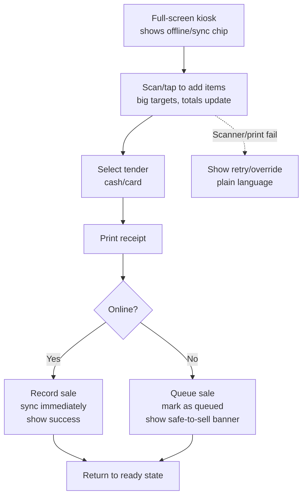
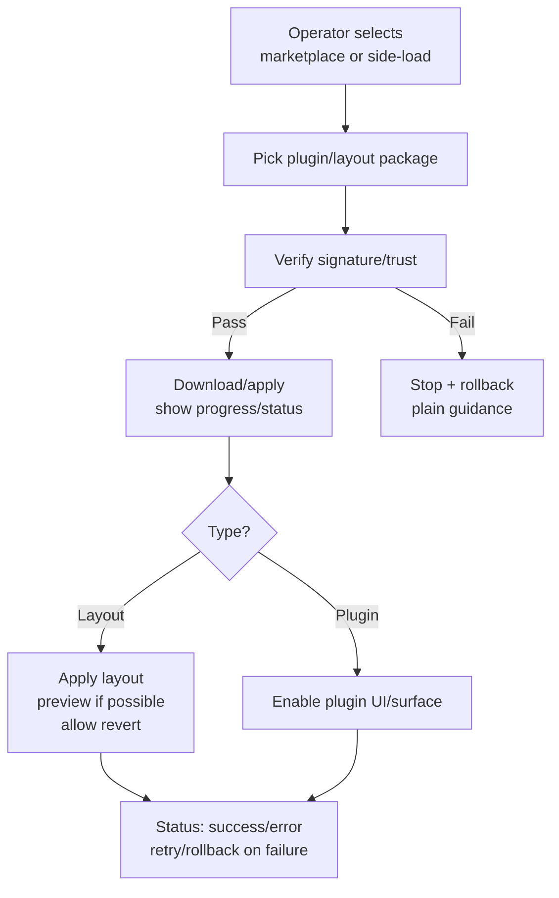
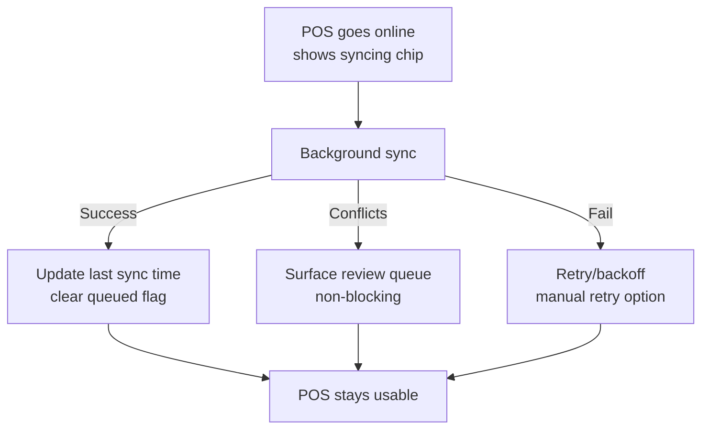

# UX Design Specification docs

**Author:** Farshid
**Date:** 2025-12-18T14:27:20Z

---

<!-- UX design content will be appended sequentially through collaborative workflow steps -->

## Executive Summary

### Project Vision
- Universal Till: offline-first, plugin-driven POS/backoffice on low-cost hardware (Pi/older PCs) with optional cloud later; Go core; everything is a plugin; marketplace + CLI for install/publish.
- Must-not-fail: POS usability (zero-training, fast on constrained devices, first sale <5 minutes) and reliable offline + plugin lifecycle (browse/install/status, side-load, cache, revocation).

### Target Users
- Aylin (mobile seller): Android/cheap device; must work offline.
- Sara (small shop): 1k+ SKUs; scanner/printer/cash drawer; offline sales.
- Publisher (developer): publishes plugin to pilot marketplace and installs on POS; needs clear status/validation.
- Operator/Admin: sets marketplace endpoint, trust/policy; installs/updates plugins; needs status/health and offline-resilient flows.

### Key Design Challenges
- Offline-first clarity: clear offline/online state, queued actions, and conflict surfacing without scaring users.
- Low-end hardware UX: fast, minimal steps, large touch targets; avoid heavy assets.
- Plugin lifecycle UX: discover → install → status → update/rollback → side-load → revocation, with trust/signature cues.
- Hardware setup UX: scanners/printers/cash drawer setup with graceful fallbacks.
- Multi-language/currency: simple locale switches; receipt/legal text hooks.

### Design Opportunities
- Zero-training checkout: “just works” sale flow with inline scanning and receipt.
- Status transparency: lightweight status panel for sync backlog and plugin state (clear, non-technical).
- Side-load/install polish: forgiving install/update path for offline pilots (success/error/retry flows).
- Trust & safety cues: signature/revocation indicators that operators can understand at a glance.

## Core User Experience

### Defining Experience
- Core loop: scan/add item → take payment → print receipt in a touch-first, full-screen kiosk UI that works offline and on low-end hardware. Keep steps minimal so first sale happens in <5 minutes.
- Plugin-friendly: install/enable plugin, see status, and use new UI surfaces without friction, even when connectivity is intermittent.

### Platform Strategy
- Platforms: desktop-class apps on Linux (incl. Pi), Windows, macOS; touch-first kiosk mode (full screen, on-screen keys); future Android/iOS using the shared Go core.
- Inputs/devices: touch primary; scanners/printers/cash drawer optional with graceful fallback. Offline-first; side-load plugins when needed.
- Admin surfaces separated from kiosk flow; allow quick exit/auto-lock/auto-logout for shared devices.

### Effortless Interactions
- Checkout: scan/tap to add, total updates instantly, big touch targets, no modal blockers; receipt prints without extra prompts.
- Offline clarity: obvious “offline but safe to sell” state; sync queued automatically; conflicts surfaced gently after reconnect.
- Plugin lifecycle: browse/install/update/rollback/side-load with clear status and trust cues; no guessing if it worked.
- Hardware setup: pair/test printer/scanner/drawer with inline success/failure feedback; safe fallbacks if absent.

### Critical Success Moments
- First sale completes in <5 minutes from install, even on low-end/touch-only kiosk.
- Offline sale completes smoothly with clear reassurance; after reconnect, sync finishes and user sees success.
- Plugin install/publish path works end-to-end (including side-load) and shows unambiguous status.
- Shared kiosk security: quick lock/auto-logout on inactivity; easy resume for the next cashier.

### Experience Principles
- Touch-first, full-screen kiosk: large targets, minimal steps, no clutter.
- Offline transparency: always show state/sync without scaring users; never block selling offline.
- Trust & status clarity: signatures/revocations and install/sync states are readable by operators, not just technicians.
- Progressive resilience: hardware optional; flows degrade gracefully when devices or network are missing.
- Time-to-value obsession: default paths favor speed to first sale and fast plugin activation.

## Desired Emotional Response

### Primary Emotional Goals
- Confident and in-control while selling, even when offline or on low-end hardware.
- Trust that plugin installs/updates are safe and clear; relief that offline sales “just work”; fast flow without friction.
- Security for shared kiosks (locked down; quick unlock; nothing breaks).

### Emotional Journey Mapping
- First use: “I can do this fast” — guided, minimal steps, touch-first.
- During checkout: calm focus; everything responds instantly; offline clearly “safe to sell.”
- Plugin actions (install/update/side-load): trust and clarity — unambiguous status.
- When things go wrong: reassured — plain-language errors with a clear next step/retry; data isn’t lost.
- Return visits: efficiency — auto full-screen kiosk, quick unlock, ready to sell.

### Micro-Emotions
- Confidence over confusion; trust over skepticism; accomplishment over frustration; calm over anxiety.

### Design Implications
- Offline/sync states visible but non-threatening; never block checkout.
- Touch-first kiosk: large targets, short flows, no modal clutter.
- Clear status for installs/updates/side-loads/revocations with human-readable trust cues.
- Error handling: concise, fixable, and never kills the sale flow.

### Emotional Design Principles
- Communicate safety and readiness (offline, sync, trust) at a glance.
- Keep the seller in flow: limit steps, keep responses instant, avoid interruptions.
- Make recovery reassuring: errors are solvable, with a way forward.

## UX Pattern Analysis & Inspiration

### Inspiring Products Analysis
- Self-checkout UIs (grocery/retail): large touch grids, clear pay/print steps, receipt preview; minimal clutter, no upsell nags.
- Square/Lightspeed patterns: simple, human-readable device/plugin status and errors with clear retry; avoid intrusive paywallish popups.
- Kiosk modes (Android/iOS): full-screen lock, idle timeout/auto-lock, on-screen keypad; avoid hidden/unclear exit gestures that confuse staff.
- Offline-friendly apps: “safe to sell offline” banner and queued-sync chip; avoid scary red errors for normal offline state.
- Console/Steam Deck: big typography and logical focus order for non-mouse input; avoid deep nested menus.

### Transferable UX Patterns
- Large, obvious touch targets and short flows for checkout and payment.
- Clear offline/sync status chips/banners that reassure without blocking.
- Human-readable install/update/side-load status with retry, not tech jargon.
- Full-screen kiosk with on-screen keypad; quick lock/exit that staff can find.
- Big-type navigation for controller/touch-like interactions on low-power devices.

### Anti-Patterns to Avoid
- Cluttered checkout with upsells or modal blockers.
- Hidden exit/lock gestures that staff can’t find in kiosk mode.
- Red “error” treatment for normal offline; blocking checkout on missing network.
- Deep/nested menus that slow down flow on touch-only devices.
- Technical error codes without a clear next step/retry.

### Design Inspiration Strategy
- Adopt: large touch grids, concise pay/print flows, clear offline “safe to sell” messaging, human-readable status/retry.
- Adapt: kiosk full-screen/idle-lock patterns to make exit/lock explicit for staff; offline sync chips styled to be calm, not alarming.
- Avoid: upsell clutter, hidden exits, blocking errors for offline, paywall-like popups, jargon-only errors.

## Design System Foundation

### 1.1 Design System Choice
- Themeable, lightweight system using utility-first styling (e.g., Tailwind + custom tokens) tuned for kiosk/touch and low-spec hardware.

### Rationale for Selection
- Speed + consistency without heavy component overhead; easy to keep fast on Pi/low-end devices.
- Touch-first kiosk needs big targets, clear focus states, full-screen layouts, and minimal JS; utility-first helps enforce spacing/scale consistently.
- Easy theming for multi-brand or future mobile shells; avoids lock-in to heavier enterprise kits.

### Implementation Approach
- Define design tokens: colors (calm base + one accent), spacing scale, typography scale for large touch targets, radii, shadows, motion primitives.
- Core components to standardize: buttons (primary/secondary/destructive), keypad, list/grid cards, status chips/banners, toasts/snackbars, dialogs (kept minimal), tabs/segmented controls for plugin surfaces.
- Layout primitives: full-screen kiosk frame, side/top nav variants, responsive grid/list that works with touch and scanner input.
- States: offline/sync chips, install/update status bars, error/retry patterns with plain language.

### Customization Strategy
- Kiosk theme: high-contrast readable text, large hit areas (44px+), generous spacing; accent used sparingly for CTAs/status.
- Trust/safety cues: consistent iconography/colors for signed/verified vs. revoked/blocked; calm “safe to sell offline” treatment.
- Hardware-friendly: styles degrade gracefully if device/driver missing; no reliance on heavy animations.
- Plugin surfaces: consistent header/status zone so plugins slot in without breaking layout; shared tokens for typography/spacing to keep plugin UIs coherent.

## 2. Core User Experience (Defining Experience)

### 2.1 Defining Experience
- Touch-first, full-screen kiosk checkout: scan/add → total → pay → print, with persistent offline/sync state and clear plugin status. Layouts can be switched/customized (including layout plugins) without breaking flow.

### 2.2 User Mental Model
- Familiar self-checkout/POS model: big touch targets, simple steps, receipts. Overlay: “safe to sell offline” banner/chip and trusted plugins/layouts with visible status.

### 2.3 Success Criteria
- First sale in <5 minutes from install; scan/pay/print feel instant on low-end hardware.
- Offline state clearly shows “safe to sell” and queues sync; no blocking of checkout.
- Plugin/layout install/update/side-load/revocation statuses are unambiguous.
- Layout changes (including layout plugins) apply without disrupting the checkout flow; easy revert to a stable layout.

### 2.4 Novel UX Patterns
- Mostly established kiosk/POS patterns; unique twist is pluginized layouts and explicit trust/offline transparency baked into the main surfaces.

### 2.5 Experience Mechanics
- Initiation: kiosk auto full-screen; on-screen keypad; optional layout selector/preset (staff-accessible); clear offline/sync chip.
- Interaction: scan/tap to add; large CTAs; status chips for offline/sync and plugin/layout apply state.
- Feedback: instant totals; receipt preview/print; plain-language status for installs/updates/side-load/revocation; success/error with retry.
- Completion: receipt printed; sale confirmed; sync queued if offline; layout/plugin changes confirmed; rollback path if a layout/plugin misbehaves.

## Visual Design Foundation

### Color System
- Brand-derived: primary deep navy `#254464`, accent teal `#4c9dcb`, neutrals `#ffffff/#d1d1d1/#000000`.
- Usage: navy for anchors/text, teal for CTAs/status highlights; neutrals for backgrounds/surfaces; semantic palette for success/warn/error with high contrast for kiosk.
- Offline/sync/install chips use calm, readable hues; avoid alarming red for normal offline.

### Typography System
- Large, legible sans (e.g., Inter/Source/Work Sans class), tuned for kiosk/touch.
- Type scale supports large targets: prominent headings, clear labels, readable body; consistent line heights for legibility on low-res/low-end screens.

### Spacing & Layout Foundation
- Base spacing: 8px (expandable to 4px increments if needed), with 44px+ hit areas for touch.
- Full-screen kiosk grids, generous padding; on-screen keypad; clear separation of primary actions vs. secondary.
- Status surfaces (chips/banners/toasts) are concise and non-blocking; layout accommodates plugin/status zones without clutter.

### Accessibility Considerations
- High-contrast defaults for navy/teal on light or dark surfaces; ensure WCAG contrast for primary text/actions.
- Large touch targets and typography for readability; minimal animation to suit low-end hardware; clear focus/active states.

## Design Direction Decision

### Design Directions Explored
- Kiosk-first directions inspired by self-checkout and Square/Lightspeed patterns: large grids, clear pay/print steps, calm offline/sync chips, human-readable install/update/side-load status, explicit full-screen/idle-lock with visible exit for staff, and plugin/layout status zones.
- Touch-first layouts tuned for low-end hardware with minimal animation and high-contrast navy/teal + neutral palette.
- Offline-friendly states that reassure rather than alarm; rollback/safe defaults for layouts/plugins.

### Chosen Direction
- A kiosk-first, low-friction POS layout with large touch targets, calm status chips (offline/sync/install), clear plugin/layout status, and explicit lock/exit controls; uses the navy/teal palette and utility-first system for speed and performance.

### Design Rationale
- Matches core loop (scan/pay/print) and must-not-fail usability on low-end/touch hardware.
- Aligns with emotional goals: confidence/trust, “safe to sell offline,” and clarity on plugin/layout changes.
- Supports pluginized layouts without disrupting flow; explicit status and rollback paths reduce anxiety.

### Implementation Approach
- Use the navy/teal/neutral palette with semantic statuses; utility-first styling for performance.
- Standardize components: large buttons, keypads, grids/cards, status chips/banners, toasts; explicit lock/exit affordances; plugin/layout status strip.
- Keep animation light; ensure high contrast, large type/hit areas; preserve flow when applying layout/plugin changes with clear success/rollback messaging.

## User Journey Flows

### Checkout (Kiosk, Offline-Safe)

### Plugin/Layout Install/Update (Marketplace or Side-load)

### Offline-to-Online Sync Recovery

### Journey Patterns
- Non-blocking operations: offline is normal; sync/install runs without blocking checkout.
- Plain-language status + retry/rollback for installs/layout changes; “safe to sell” offline treatment.
- Explicit lock/exit and layout revert to keep kiosk stable for shared devices.

### Flow Optimization Principles
- Minimize steps to sale and to apply plugins/layouts; never block checkout for network.
- Always show state (offline/sync/install) calmly; keep primary flow usable under failure.
- Provide immediate recovery paths: retry, rollback, revert to stable layout.

## Component Strategy

### Design System Components
- From the utility-first system: buttons (primary/secondary/destructive), inputs, selects, tabs/segmented controls, cards/lists, chips/badges, toasts/snackbars, banners, dialogs (kept minimal), grid/flex primitives, typography/spacing tokens.

### Custom Components
- Kiosk keypad: large, high-contrast numeric pad for amounts/quantities with clear affordances.
- Checkout line + totals panel: fast-updating list/grid with big totals and tender actions.
- Status strip/chips: inline offline/sync/plugin/install states; calm, non-blocking; always visible.
- Plugin/Layout install panel: trust/signature indicator, progress, errors with retry; side-load flow; clear success/rollback actions.
- Layout selector + revert: choose/apply layout presets/plugins; preview (if possible); one-tap revert to last stable layout.
- Lock/exit bar: explicit lock/log-out and exit controls for kiosk; idle timeout surface.
- Receipt preview/print module: simple preview, print, and fallback guidance.
- Hardware setup/test module: printer/scanner/drawer detection with inline test/feedback and graceful fallback.

### Component Implementation Strategy
- Build customs with existing tokens (color, spacing, type, radii) and utility classes; keep DOM/CSS lean for low-spec devices.
- Standardize states: default/active/disabled/error; clear focus/hover/touch feedback; plain-language status and retry/rollback hooks.
- Reserve zones: status strip at top; plugin/layout status within admin/operator views; lock/exit affordance consistently placed.

### Implementation Roadmap
- Phase 1 (MVP checkout): keypad, checkout line/totals, status strip/chips, receipt preview/print, lock/exit bar.
- Phase 2 (Plugin/layout): install panel (marketplace/side-load), trust/signature indicators, layout selector + revert.
- Phase 3 (Support/ops): hardware setup/test module, richer status/telemetry views; refinements to plugin/layout flows as needed.

## UX Consistency Patterns

### Button Hierarchy
- Primary: solid navy/teal; Secondary: outline/ghost; Destructive: warm/red. Large touch targets; avoid tiny icon-only primaries. Primary sits right/last in flows; destructive separated from primary paths.

### Feedback Patterns
- Status chips/banners for offline/sync/install; calm, always visible.
- Toasts for success/light info; inline errors with retry; avoid modal-blocking errors.
- Plain language for failures; show next step/rollback where applicable.

### Form Patterns
- Minimal fields; large inputs; inline validation; numeric keypad for amounts/quantities.
- Clear labels; show required/optional; scan-first for SKUs where possible.
- Avoid multi-step modal stacks; keep flows shallow.

### Navigation Patterns
- Kiosk full-screen with explicit lock/exit; status strip reserved.
- Segmented/tabs for plugin surfaces; avoid deep nesting; admin separated from checkout.
- Layout selector/revert kept in operator/admin context to avoid runtime disruptions.

### Additional Patterns
- Empty/loading: calm placeholders; minimal shimmer/skeleton; contextual “queued” when offline.
- Search/filter: large search bar; filters as chips/toggles; scan-to-add prioritized.
- Errors: plain language + retry/rollback; never block checkout for offline/state issues.
- Plugin/layout changes: show status/progress; trust indicators; revert option after apply.

## Responsive Design & Accessibility

### Responsive Strategy
- Primary: kiosk/desktop full-screen layout. Tablet: same touch layout with modest density tweaks. Mobile (future shells): collapse grids to lists, bottom actions, simplified status strip.

### Breakpoint Strategy
- Mobile <768px, Tablet 768–1023px, Desktop ≥1024px. Mobile-first CSS, but kiosk stays full-screen on desktop/tablet.

### Accessibility Strategy
- Target WCAG AA; 44px+ touch targets; strong contrast; semantic HTML; clear focus states; ARIA labels/roles; plain-language errors; keyboard/focusable admin surfaces; status/lock reachable.

### Testing Strategy
- Real devices: Pi/low-end PC, a tablet; offline/slow network scenarios.
- Accessibility: contrast checks, keyboard/focus traversal, screen reader for admin/operator views, color-blind simulation for status chips.

### Implementation Guidelines
- Mobile-first media queries; rem/%/vw units; minimal animation for low-spec hardware.
- Semantic structure; ARIA labels/roles; skip/lock/exit clarity; status strip always reachable.
